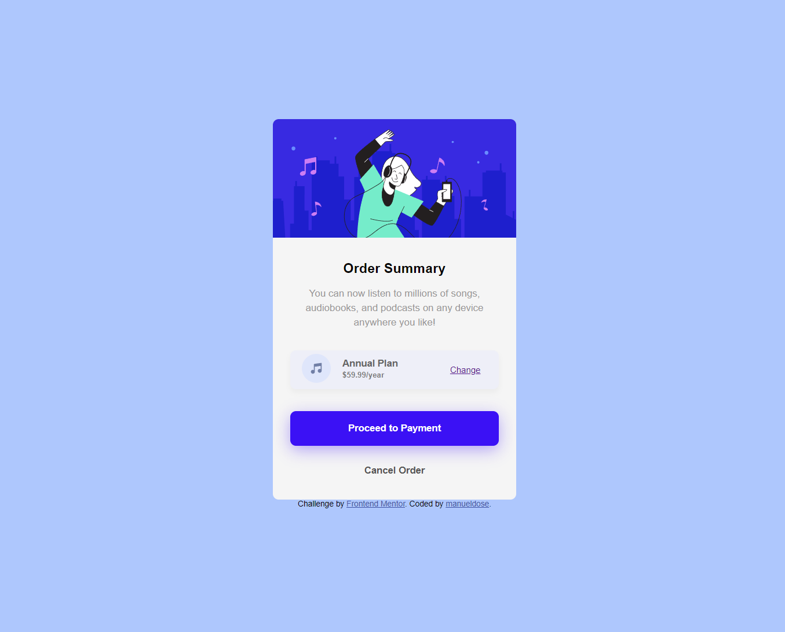

# Frontend Mentor - Order summary card solution

This is a solution to the [Order summary card challenge on Frontend Mentor](https://www.frontendmentor.io/challenges/order-summary-component-QlPmajDUj). Frontend Mentor challenges help you improve your coding skills by building realistic projects.

## Table of contents

- [Overview](#overview)
  - [The challenge](#the-challenge)
  - [Screenshot](#screenshot)
  - [Links](#links)
- [My process](#my-process)
  - [Built with](#built-with)
  - [What I learned](#what-i-learned)
  - [Continued development](#continued-development)
  - [Useful resources](#useful-resources)
- [Author](#author)
- [Acknowledgments](#acknowledgments)

**Note: Delete this note and update the table of contents based on what sections you keep.**

## Overview

### The challenge

Users should be able to:

- See hover states for interactive elements

### Screenshot




### Links

- Solution URL: [Add solution URL here](https://manueldose.github.io/cautious-octo-lamp/)


## My process

### Built with

- Semantic HTML5 markup
- CSS custom properties
- Flexbox
- Mobile-first workflow


### What I learned

I've improved my knowledge with html and css. Mainly working with classes, applying logical ways

```css
.layout-payment {
  width: 90%;
  min-inline-size: 18rem;
  max-inline-size: 25rem;
  max-block-size: 9.37rem;
  margin: 15px auto;
  padding: 1rem;
  color: white;
  font-weight: bolder;
  background-color: rgb(59, 17, 245);
  border: none;
  border-radius: .5rem;
  box-shadow: 0 6px 22px rgb(59 17 245 / 36%);
  align-items: center;
}
```


### Continued development

I would like to continue acquiring more knowledge around the world of responsive. And to deepen and settle more knowledge in css


## Author

- Website - [manueldose](https://github.com/manueldose)


